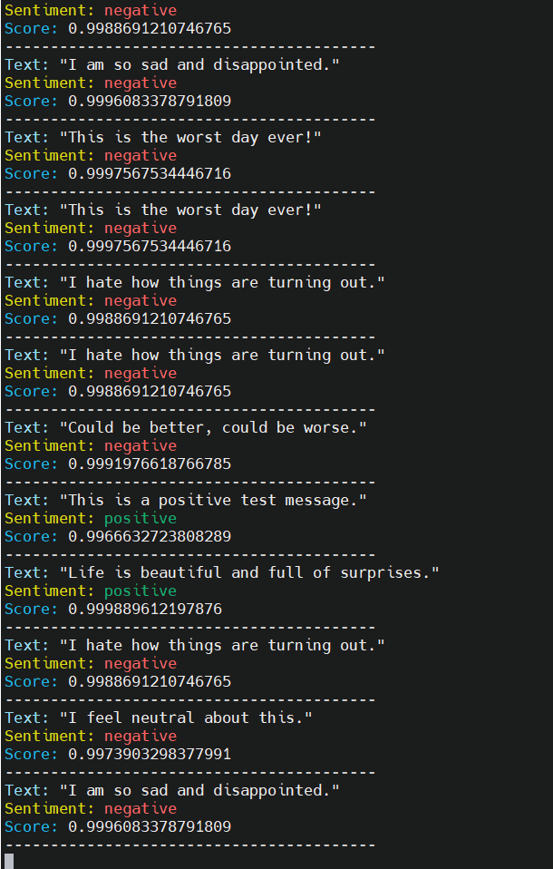

# edge-ai-sentiment-k3s
Edge AI on a Mini Kubernetes Cluster with Raspberry Pi Nodes
# Edge AI for Sentiment Analysis

## Demonstrations

| Demo | Description |
|------|-------------|
|  | **Kublet:** Running Raspberry Pi nodes with k3s cluster. |
|  | **Prometheus:** Metric scraping and alert rules demo. |
|  | **Node Exporter:** NodeExporter statistics on a Grfana dashboard |
|  | **Node Statistics:** Node statistics using Grafana dashboard. |
|  | **Stress Test:** Sentiment analysis real-time stress test. |
|  | **Raspberry Pi Cluster:** Real-time running of Raspberry Pi's 3/4 hardware as part of the cluster. |
|  | **Deployment Demo:** Sentiment Analysis deployment and running K3S cluster nodes. |
